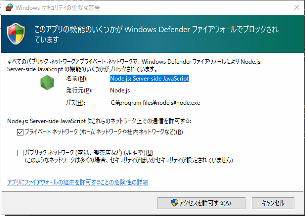

# API Blueprint を使用した WEB API仕様書

## API Blueprint とは

APIの仕様をMarkdown拡張記法で記述できる記述方法です。エクセルで作成された仕様書と違ってBlueprintはGit管理と相性が良いというメリットがあります。また、Blueprint は記述方法のフォーマットでしか無く、実際に活用する場合は複数の拡張ツールを利用し開発効率を押し上げることが可能です。

公式サイト）
https://apiblueprint.org/

## API Blueprint を使用した仕様書作成

* 一つのHTMLファイルにすべてのAPI仕様をまとめて出力


## ノードモジュール（プラグイン）便利機能
* HTMLでの仕様書ドキュメント自動生成機能
  * 拡張子aipbファイルからhtmlファイルを生成可能（拡張子はapib以外にもmdで作成している例もあります）
* 仕様修正作業中にWebブラウザでリアルタイムプレビューが可能
  * 変更が即時ブラウザに反映されます。
* モックサーバー
  * 仕様書を元にモックサーバーが起動できます。


## Node.js 
Node.jsのインストールが必要です ※カッコ内表記は本書作成時に利用したバージョン

* Node.js  ( v12.13.1 )
  * 公式：https://nodejs.org/ja/


## Nodeモジュール（プラグイン）のインストール

### ① aglioとgulpをインストールします。

-g オプションを使用してインストールします。
```bat
npm install -g aglio
npm install -g gulp
```


### ② nodemoduleのインストール

package.jsonを元にインストール

```bat
npm i
```

#### ※新規プロジェクトの場合
```bat
npm install gulp gulp-aglio -D
npm install browser-sync -D
npm install rimraf -D
npm install gulp-ejs -D
npm install gulp-rename -D
npm install api-mock -D
```

※参考までに
 本紙作成時の環境でインストール時にPythonに関するエラーが発生しましたが、動作に影響は有りませんでした。
  エラーを解消する方法はターミナル（管理権限）で以下内容を実行

  ```bat
  npm install --global windows-build-tools
  ```
参考サイト） 

https://qiita.com/planethouki/items/242804904df308c8e823


## gulpについて
gulpは編集したblueprintファイルをリアルタイムでhtml化やブラウザリロードなどを支援するためのツールです。開発効率を向上させる為に利用します。


#### gulpfile.js

ドキュメント自動生成等を設定します。※gulp v4系の記述方法

```js
var gulp = require('gulp');
var aglio = require('gulp-aglio');
var browserSync = require('browser-sync');
var rename = require('gulp-rename');
var rimraf = require('rimraf');
var ejs = require('gulp-ejs');
//各種パス
var DIST_DIR = 'api_docs';
var SRC_DIR = 'api_docs_src';
var LAYOUT_APIB_FILE = SRC_DIR + '/layout.apib';
var INDEX_APIB_FILE = DIST_DIR + '/index.apib';
var WATCH_TARGET_FILE = [SRC_DIR + '/**/*.apib'];

//apibファイルの結合
gulp.task('combine', function () {
  return gulp.src(LAYOUT_APIB_FILE)
    .pipe(ejs({}, { ext: '.apib' }))
    .pipe(rename('index.apib'))
    .pipe(gulp.dest(DIST_DIR));
});

//結合されたapibファイルからhtmlファイル生成
gulp.task('output', function () {
  return gulp.src(INDEX_APIB_FILE)
    .pipe(aglio({ template: 'default' }))
    .pipe(gulp.dest(DIST_DIR));
});

//ブラウザのリロード
gulp.task('reload', function (done) {
  browserSync.reload();
  done();
});

//ファイルの変更監視
//変更があった時点でhtmlを再生成しブラウザをリロード
gulp.task('watch', function () {
  gulp.watch(WATCH_TARGET_FILE, gulp.series(['combine', 'output', 'reload']));
});

//内蔵ブラウザ起動
gulp.task('browserSync', function () {
  browserSync({
    logConnections: true,
    logFileChanges: true,
    notify: true,
    port: 8088,
    open: false,
    server: {
      baseDir: DIST_DIR
    }
  });
});

//サーバー起動
gulp.task('server', gulp.parallel(['browserSync', 'watch']));

```


#### gulpのバージョンに関する注意点

v3系とv4系でいつくかの仕様変更があり、ネット上に公開されているソースでは動作しないケースがあります。

gulp.parallelやgulp.series などが [gulp v4系] で追加されています。

参考サイト)
https://designsupply-web.com/media/knowledgeside/4410/


#### gulpコマンド

##### サーバー起動～ファイル監視～更新検知でブラウザリロード

```bat
gulp server
```
初回起動時はファイアウォールの警告が表示されます。



## エラー発生しやすい箇所の補足


### Windows PowerShellでの実行ポリシーによるエラー

**発生状況**

Windows PowerShellで gulp コマンドを実行する時に発生

エラーメッセージは以下の通り

```
 gulp: このシステムではスクリプトの実行が無効になっているため、ファイル C:\{省略}npm\gulp.ps1 を読み込むことができません。詳細につ  
いては、「about_Execution_Policies」(https://go.microsoft.com/fwlink/?LinkID=135170) を参照してください。
発生場所 行:1 文字:1・・・{以下略}
```

**原因**

PowerShellの実行ポリシーの設定によるエラー

参考URL: https://qiita.com/Targityen/items/3d2e0b5b0b7b04963750

**対策**①

実行ポリシーの変更 (恒久的)

PowerShell（管理者権限）で以下コマンドを実行する

```PowerShell
 Set-ExecutionPolicy RemoteSigned
```

参考URL: https://qiita.com/Targityen/items/3d2e0b5b0b7b04963750